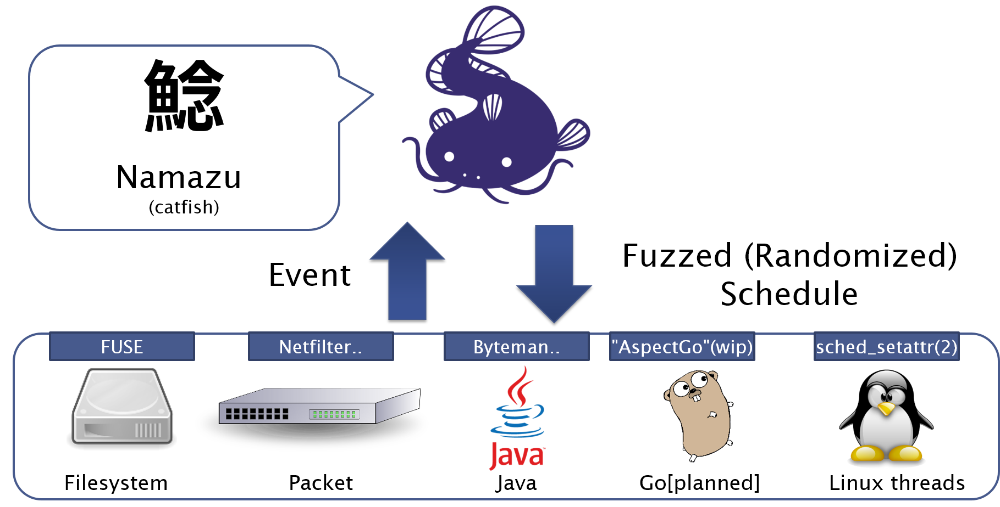
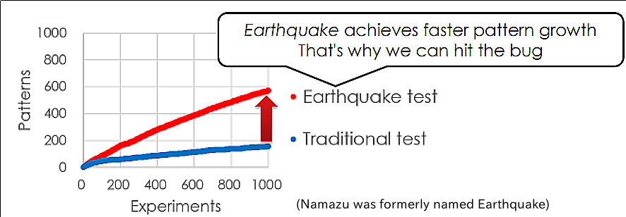

# Namazu: Programmable Fuzzy Scheduler for Testing Distributed Systems

[](https://github.com/osrg/namazu/releases/latest)
[](https://gitter.im/osrg/namazu?utm_source=badge&utm_medium=badge&utm_campaign=pr-badge&utm_content=badge)
[](https://godoc.org/github.com/osrg/namazu/nmz)
[](https://travis-ci.org/osrg/namazu)
[](https://coveralls.io/github/osrg/namazu?branch=master)
[](https://goreportcard.com/report/github.com/osrg/namazu)

Namazu (formerly named Earthquake) is a programmable fuzzy scheduler for testing real implementations of distributed system such as ZooKeeper.



Namazu permutes Java function calls, Ethernet packets, Filesystem events, and injected faults in various orders so as to find implementation-level bugs of the distributed system.
Namazu can also control non-determinism of the thread interleaving (by calling `sched_setattr(2)` with randomized parameters).
So Namazu can be also used for testing standalone multi-threaded software.

Basically, Namazu permutes events in a random order, but you can write your [own state exploration policy](doc/arch.md) (in Golang) for finding deep bugs efficiently.

[Namazu (鯰) means a catfish :fish: in Japanese](https://en.wiktionary.org/wiki/%E9%AF%B0).

Blog: [http://osrg.github.io/namazu/](http://osrg.github.io/namazu/)

Twitter: [@NamazuFuzzTest](https://twitter.com/NamazuFuzzTest)

## Found and Reproduced Bugs

:new:=Found, :repeat:=Reproduced

### Flaky integration tests

Issue|Reproducibility<br>(traditional)|Reproducibility<br>(Namazu)|Note
---|---|---|---
:new: [ZOOKEEPER-2212](https://issues.apache.org/jira/browse/ZOOKEEPER-2212)<br>(race)|0%|21.8%|In traditional testing, we could not reproduce the issue in 5,000 runs (60 hours). We newly found the issue and improved its reproducibility using Namazu Ethernet inspector. Note that the reproducibility improvement depends on its configuration(see also [#137](https://github.com/osrg/namazu/pull/137)).<br>[Blog article](http://osrg.github.io/namazu/post/zookeeper-2212/) and repro code ([Ryu SDN version](example/zk-found-2212.ryu) and [Netfilter version](example/zk-found-2212.nfqhook)) are available.

### Flaky xUnit tests (picked out, please see also [#125](https://github.com/osrg/namazu/issues/125))

Issue|Reproducibility<br>(traditional)|Reproducibility<br>(Namazu)|Note
---|---|---|---
:repeat: [YARN-4548](https://issues.apache.org/jira/browse/YARN-4548)|11%|82%|Used Namazu process inspector.
:repeat: [ZOOKEEPER-2080](https://issues.apache.org/jira/browse/ZOOKEEPER-2080)|14%|62%|Used Namazu Ethernet inspector. [Blog article](http://osrg.github.io/namazu/post/zookeeper-2080/) and [repro code](example/zk-repro-2080.nfqhook) are available.
:repeat: [YARN-4556](https://issues.apache.org/jira/browse/YARN-4548)|2%|44%|Used Namazu process inspector.
:repeat: [YARN-5043](https://issues.apache.org/jira/browse/YARN-5043)|12%|30%|Used Namazu process inspector.
:repeat: [ZOOKEEPER-2137](https://issues.apache.org/jira/browse/ZOOKEEPER-2137)|2%|16%|Used Namazu process inspector.
:repeat: [YARN-4168](https://issues.apache.org/jira/browse/YARN-4168)|1%|8%|Used Namazu process inspector.
:repeat: [YARN-1978](https://issues.apache.org/jira/browse/YARN-1978)|0%|4%|Used Namazu process inspector.
:repeat: etcd [#5022](https://github.com/coreos/etcd/issues/5022)|0%|3%|Used Namazu process inspector.

We also improved reproducibility of some flaky etcd tests (to be documented).

### Others

Issue|Note
---|---
:new: [YARN-4301](https://issues.apache.org/jira/browse/YARN-4301)<br>(fault tolerance)|Used Namazu filesystem inspector and Namazu API. [Repro code](example/yarn/4301-reproduce) is available.
:new: etcd command line client (etcdctl) [#3517](https://github.com/coreos/etcd/issues/3517)<br>(timing specification)|Used Namazu Ethernet inspector. [Repro code](example/etcd/3517-reproduce) is available.<br>The issue has been fixed in [#3530](https://github.com/coreos/etcd/pull/3530) and it also resulted a hint of [#3611](https://github.com/coreos/etcd/pull/3611).

## Talks

 * [ApacheCon Core North America](http://sched.co/6OJU) (May 11-13, 2016, Vancouver) [[slide](http://www.slideshare.net/AkihiroSuda/flaky-tests-and-bugs-in-apache-software-eg-hadoop)]
 * [CoreOS Fest](http://sched.co/6Szb) (May 9-10, 2016, Berlin) [[slide](http://www.slideshare.net/mitakeh/namazu-a-debugger-for-distributed-systems-specific-bugs/1)]
 * [FOSDEM](https://fosdem.org/2016/schedule/event/nondeterminism_in_hadoop/) (January 30-31, 2016, Brussels) [[slide](http://www.slideshare.net/AkihiroSuda/tackling-nondeterminism-in-hadoop-testing-and-debugging-distributed-systems-with-earthquake-57866497)]
 * The poster session of [ACM Symposium on Cloud Computing (SoCC)](http://acmsocc.github.io/2015/) (August 27-29, 2015, Hawaii) [[poster](http://acmsocc.github.io/2015/posters/socc15posters-final18.pdf)]

## Getting Started
### Installation
The installation process is very simple:

    $ sudo apt-get install libzmq3-dev libnetfilter-queue-dev
    $ go get github.com/osrg/namazu/nmz

Currently, Namazu is tested with [Go 1.6](https://golang.org/dl/).

You can also download the latest binary from [here](https://github.com/osrg/namazu/releases).

### Container Mode
The following instruction shows how you can start *Namazu Container*, the simplified, Docker-like CLI for Namazu.

    $ sudo nmz container run -it --rm -v /foo:/foo ubuntu bash


In *Namazu Container*, you can run arbitrary command that might be *flaky*.
JUnit tests are interesting to try.

    nmzc$ git clone something
    nmzc$ cd something
    nmzc$ for f in $(seq 1 1000);do mvn test; done


You can also specify a config file (`--nmz-autopilot` option for `nmz container`.)
A typical configuration file (`config.toml`) is as follows:

```toml
# Policy for observing events and yielding actions
# You can also implement your own policy.
# Default: "random"
explorePolicy = "random"

[explorePolicyParam]
  # for Ethernet/Filesystem/Java inspectors, event are non-deterministically delayed.
  # minInterval and maxInterval are bounds for the non-deterministic delays
  # Default: 0 and 0
  minInterval = "80ms"
  maxInterval = "3000ms"

  # for Ethernet/Filesystem inspectors, you can specify fault-injection probability (0.0-1.0).
  # Default: 0.0
  faultActionProbability = 0.0

  # for Process inspector, you can specify how to schedule processes
  # "mild": execute processes with randomly prioritized SCHED_NORMAL/SCHED_BATCH scheduler.
  # "extreme": pick up some processes and execute them with SCHED_RR scheduler. others are executed with SCHED_BATCH scheduler.
  # "dirichlet": execute processes with SCHED_DEADLINE scheduler. Dirichlet-distribution is used for deciding runtime values.
  # Default: "mild"
  procPolicy = "extreme"

[container]
  # Default: false
  enableEthernetInspector = true
  ethernetNFQNumber = 42
  # Default: true
  enableProcInspector = true
  procWatchInterval = "1s"
  # Default: true (for volumes (`-v /foo:/bar`))
  enableFSInspector = true
```
For other parameters, please refer to [`config.go`](nmz/util/config/config.go) and [`randompolicy.go`](nmz/explorepolicy/random/randompolicy.go).


### Non-container Mode

#### Process inspector

    $ sudo nmz inspectors proc -pid $TARGET_PID -watch-interval 1s

By default, all the processes and the threads under `$TARGET_PID` are randomly scheduled.

You can also specify a config file by running with `-autopilot config.toml`.

You can also set `-orchestrator-url` (e.g. `http://127.0.0.1:10080/api/v3`) and `-entity-id` for distributed execution.

Note that the process inspector may be not effective for reproducing short-running flaky tests, but it's still effective for long-running tests: [issue #125](https://github.com/osrg/namazu/issues/125).


The guide for reproducing flaky Hadoop tests (please use `nmz` instead of `microearthquake`): [FOSDEM slide 42](http://www.slideshare.net/AkihiroSuda/tackling-nondeterminism-in-hadoop-testing-and-debugging-distributed-systems-with-earthquake-57866497/42).


#### Filesystem inspector (FUSE)

    $ mkdir /tmp/{nmzfs-orig,nmzfs}
    $ sudo nmz inspectors fs -original-dir /tmp/nmzfs-orig -mount-point /tmp/nmzfs -autopilot config.toml
	$ $TARGET_PROGRAM_WHICH_ACCESSES_TMP_NMZFS
	$ sudo fusermount -u /tmp/nmzfs

By default, all the `read`, `mkdir`, and `rmdir` accesses to the files under `/tmp/nmzfs` are randomly scheduled.
`/tmp/nmzfs-orig` is just used as the backing storage.
(Note that you have to set `explorePolicyParam.minInterval` and `explorePolicyParam.maxInterval` in the config file.)

You can also inject faullts (currently just injects `-EIO`) by setting `explorePolicyParam.faultActionProbability` in the config file.

#### Ethernet inspector (Linux netfilter_queue)

    $ iptables -A OUTPUT -p tcp -m owner --uid-owner $(id -u johndoe) -j NFQUEUE --queue-num 42
    $ sudo nmz inspectors ethernet -nfq-number 42
	$ sudo -u johndoe $TARGET_PROGRAM
	$ iptables -D OUTPUT -p tcp -m owner --uid-owner $(id -u johndoe) -j NFQUEUE --queue-num 42

By default, all the packets for `johndoe` are randomly scheduled (with some optimization for TCP retransmission).

You can also inject faults (currently just drop packets) by setting `explorePolicyParam.faultActionProbability` in the config file.

#### Ethernet inspector (Openflow 1.3)

You have to install [ryu](https://github.com/osrg/ryu) and [hookswitch](https://github.com/osrg/hookswitch) for this feature.

    $ sudo pip install ryu hookswitch
    $ sudo hookswitch-of13 ipc:///tmp/hookswitch-socket --tcp-ports=4242,4243,4244
	$ sudo nmz inspectors ethernet -hookswitch ipc:///tmp/hookswitch-socket

Please also refer to [doc/how-to-setup-env-full.md](doc/how-to-setup-env-full.md) for this feature.

#### Java inspector (AspectJ, byteman)

To be documented

## How to Contribute
We welcome your contribution to Namazu.
Please feel free to send your pull requests on github!

    $ cd $GOPATH/src/github.com/osrg
    $ git clone https://github.com/YOUR_GITHUB_ACCOUNT/namazu.git
    $ cd namazu
    $ git checkout -b your-branch
    $ ./build
    $ your-editor foo.go
    $ ./clean && ./build && go test -race ./nmz/...
    $ git commit -a -s

## Copyright
Copyright (C) 2015 [Nippon Telegraph and Telephone Corporation](http://www.ntt.co.jp/index_e.html).

Released under [Apache License 2.0](LICENSE).

---------------------------------------
## Advanced Guide
### Distributed execution

Basically please follow these examples: [example/zk-found-2212.ryu](example/zk-found-2212.ryu), [example/zk-found-2212.nfqhook](example/zk-found-2212.nfqhook)

#### Step 1
Prepare `config.toml` for distributed execution.
Example:
```toml
# executed in `nmz init`
init = "init.sh"

# executed in `nmz run`
run = "run.sh"

# executed in `nmz run` as the test oracle
validate = "validate.sh"

# executed in `nmz run` as the clean-up script
clean = "clean.sh"

# REST port for the communication.
# You can also set pbPort for ProtocolBuffers (Java inspector)
restPort = 10080

# of course you can also set explorePolicy here as well
```

#### Step 2
Create `materials` directory, and put `*.sh` into it.

#### Step 3
Run `nmz init --force config.toml materials /tmp/x`.

This command executes `init.sh` for initializing the workspace `/tmp/x`.
`init.sh` can access the `materials` directory as `${NMZ_MATERIALS_DIR}`.

#### Step 4
Run `for f in $(seq 1 100);do nmz run /tmp/x; done`.

This command starts the orchestrator, and executes `run.sh`, `validate.sh`, and `clean.sh` for testing the system (100 times).

`run.sh` should invoke multiple Namazu inspectors: `nmz inspectors <proc|fs|ethernet> -entity-id _some_unique_string -orchestrator-url http://127.0.0.1:10080/api/v3`

`*.sh` can access the `/tmp/x/{00000000, 00000001, 00000002, ..., 00000063}` directory as `${NMZ_WORKING_DIR}`, which is intended for putting test results and some relevant information. (Note: 0x63==99)

`validate.sh` should exit with zero for successful executions, and with non-zero status for failed executions.

`clean.sh` is an optional clean-up script for each of the execution.

#### Step 5
Run `nmz summary /tmp/x` for summarizing the result.

If you have [JaCoCo](http://eclemma.org/jacoco/) coverage data, you can run `java -jar bin/nmz-analyzer.jar --classes-path /somewhere/classes /tmp/x` for counting execution patterns as in [FOSDEM slide 18](http://www.slideshare.net/AkihiroSuda/tackling-nondeterminism-in-hadoop-testing-and-debugging-distributed-systems-with-earthquake-57866497/18).



### API for your own exploration policy

```go
// implements nmz/explorepolicy/ExplorePolicy interface
type MyPolicy struct {
	actionCh chan Action
}

func (p *MyPolicy) ActionChan() chan Action {
	return p.actionCh
}

func (p *MyPolicy) QueueEvent(event Event) {
	// Possible events:
	//  - JavaFunctionEvent (byteman)
	//  - PacketEvent (Netfilter, Openflow)
	//  - FilesystemEvent (FUSE)
	//  - ProcSetEvent (Linux procfs)
	//  - LogEvent (syslog)
	fmt.Printf("Event: %s\n", event)
	// You can also inject fault actions
	//  - PacketFaultAction
	//  - FilesystemFaultAction
	//  - ProcSetSchedAction
	//  - ShellAction
	action, err := event.DefaultAction()
	if err != nil {
		panic(err)
	}
	// send in a goroutine so as to make the function non-blocking.
	// (Note that nmz/util/queue/TimeBoundedQueue provides
	// better semantics and determinism, this is just an example.)
	go func() {
		fmt.Printf("Action ready: %s\n", action)
		p.actionCh <- action
		fmt.Printf("Action passed: %s\n", action)
	}()
}

func NewMyPolicy() ExplorePolicy {
	return &MyPolicy{actionCh: make(chan Action)}
}

func main(){
	RegisterPolicy("mypolicy", NewMyPolicy)
	os.Exit(CLIMain(os.Args))
}
```
Please refer to [example/template](example/template) for further information.

### Semi-deterministic replay
If an event structure has `replay_hint` hash string (that does not contain time-dependent/random things),
you can semi-deterministically replay a scenario using `time.Duration(hash(seed,replay_hint) % maxInterval)`.
No record is required for replaying.

We have a PoC for ZOOKEEPER-2212. Please refer to [#137](https://github.com/osrg/namazu/pull/137).

We also implemented a similar thing for Go: [go-replay](https://github.com/AkihiroSuda/go-replay).

### Known Limitation
After running Namazu (process inspector with `exploreParam.procPolicyParam="dirichlet"`) many times, `sched_setattr(2)` can fail with `EBUSY`.
This seems to be a bug of kernel; We're looking into this.

### FAQs

#### Q. The example test always fails (or always succeeds). What does it mean?

A. Probably it is due to a misconfiguration. Please check the logs.

e.g. [example/zk-found-2212.nfqhook](example/zk-found-2212.nfqhook):

    $ nmz init --force config.toml materials /tmp/zk-2212
    $ nmz run /tmp/zk-2212
    Validation failed: ...
    $ ls -l /tmp/zk-2212/00000000/
    total 296
    drwxr-xr-x 2 root      root   4096 Sep  5 05:30 actions/
    -rw-r--r-- 1 root      root   1098 Sep  5 05:30 check-fle-states.log
    -rw-r--r-- 1 root      root      2 Sep  5 05:30 check-fle-states.result
    srwxr-xr-x 1 root      root      0 Sep  5 05:29 ether_inspector=
    -rw-r--r-- 1 root      root  33369 Sep  5 05:30 history
    -rw-r--r-- 1 root      root  97856 Sep  5 05:30 inspector.log
    -rw-r--r-- 1 root      root      6 Sep  5 05:29 inspector.pid
    -rw-r--r-- 1 root      root 126836 Sep  5 05:30 nfqhook.log
    -rw-r--r-- 1 root      root      6 Sep  5 05:29 nfqhook.pid
    -rw-r--r-- 1 root      root   1302 Sep  5 05:30 nmz.log
    -rw-r--r-- 1 root      root     71 Sep  5 05:30 result.json
    drwxr-xr-x 3 nfqhooked root   4096 Sep  5 05:30 zk1/
    drwxr-xr-x 3 nfqhooked root   4096 Sep  5 05:30 zk2/
    drwxr-xr-x 3 nfqhooked root   4096 Sep  5 05:30 zk3/

If an error is recorded in `inspector.log` or `nfqhook.log`, probably the ZooKeeper packet inspector (written in python, [misc/pynmz](misc/pynmz)) is not working due to some dependency issue. Please install required packages accordingly.

You may also need to adjust some parameter in `/tmp/zk-2212/config.toml`, such as `explorePolicyParam.maxInterval` and `explorePolicyParam.minInterval` for higher reproducibility.


---------------------------------------
If you have any questions, please do not hesitate to contact us via [GitHub issues](https://github.com/osrg/namazu/issues) or via [Gitter](https://gitter.im/osrg/namazu).
